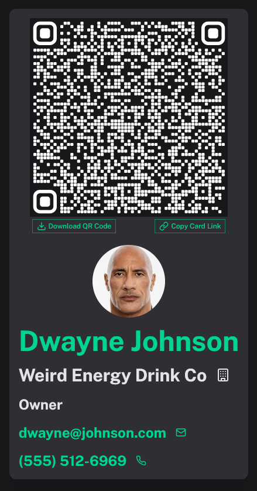

# Cardyo - Simple PWA for Digital Business Card Creation



Cardyo is a lightweight Progressive Web App (PWA) that allows users to create and share digital business cards. All the card's data is embedded in the URL query parameters, making it easily shareable via a QR code or direct link.  

## 🚀 Features  

- 🖼️ **Customizable Cards**: Input Name, Company, Title, Avatar Image, Email, and Phone Number  
- 🔗 **URL-Based Storage**: No database required, all data lives in the URL query parameters  
- 📱 **PWA Support**: Installable on mobile and desktop  
- 📷 **QR Code Generation**: Instantly generate and download a QR code for easy sharing  
- 🖥️ **Lightweight & Fast**: Built with Nuxt.js for seamless performance
- Downlaodable Contact Card (.vcf)

## Installation

- Run the following command to pull the docker image:
```
docker pull ghcr.io/kyaustad/cardyo:latest
```
- Run this command to run the docker container on your machine:
```
docker run -d -p 8080:3000 ghcr.io/kyaustad/cardyo:latest 
```
The ``` -d ``` runs the container in detached mode ( in the background ) and change the ``` 8080 ``` to whatever port you want the container to run on. 3000 is the internal container port, do not change that.

### Unraid Installation

- Go to the Docker tab and at the bottom press, Add Container.
- For the repsitory put:
```
ghcr.io/kyaustad/cardyo:latest
```
-  Then scroll down and add a new port and for the container port put ``` 3000 ``` and for the Host port put whatever you want it to run on.
-  Thats it! You have to name the image and when you hit apply it will pull the image and run it if there are no conflicts.

## 🛠️ Tech Stack  

- **Nuxt.js** (Vue 3 & Vite)  
- **PWA Module** for offline support  
- **QR Code Generator**  
- **Tailwind CSS** for styling  


## 🔄 How It Works  

1. Enter your details (Name, Company, Title, Avatar URL, Email, Phone)  
2. Generate a shareable link with all data encoded in the URL  
3. Download a QR code for quick sharing  
4. Others can scan or click the link to instantly see the digital card  

## 📜 License  

This project is licensed under the [MIT License](LICENSE).  

---

💡 **Contributions are welcome!** Feel free to submit issues or pull requests.  
